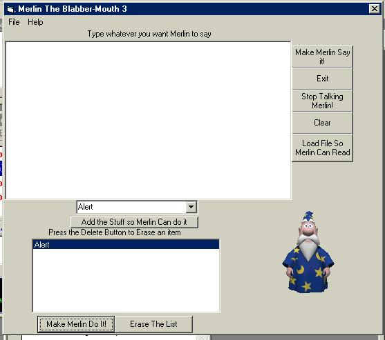



## Merlin The Blabber\-Mouth 3  Prototype 1 \(Check it out\!\)

### Description

This is Merlin The Blabber-Mouth 3. Please vote and send comments. The latest in a short line of software. In this software you can make Merlin do what ever you want with a simple 5 clicks of the mouse. lol. This is more advanced than before. Now you can open files and Merlin will read them. So check it out. Please vote and send comments.
 
### More Info
 

             |
---                |---
**Submitted On**   |2003-07-19 13:07:26
**By**             |[Orly Leiva](https://github.com/Planet-Source-Code/PSCIndex/blob/master/ByAuthor/orly-leiva.md)
**Level**          |Intermediate
**User Rating**    |5.0 (10 globes from 2 users)
**Compatibility**  |VB 6\.0
**Category**       |[Coding Standards](https://github.com/Planet-Source-Code/PSCIndex/blob/master/ByCategory/coding-standards__1-43.md)
**World**          |[Visual Basic](https://github.com/Planet-Source-Code/PSCIndex/blob/master/ByWorld/visual-basic.md)
**Archive File**   |[Merlin\_The1617457192003\.zip](https://github.com/Planet-Source-Code/orly-leiva-merlin-the-blabber-mouth-3-prototype-1-check-it-out__1-47029/archive/master.zip)

